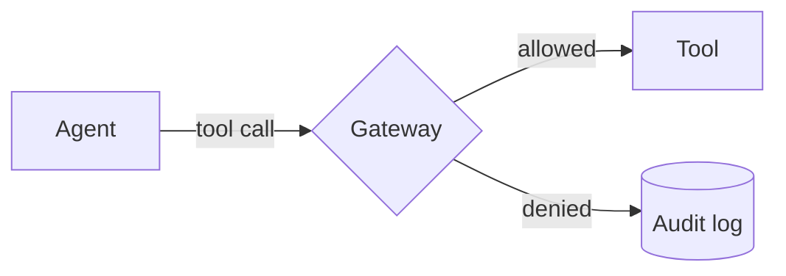
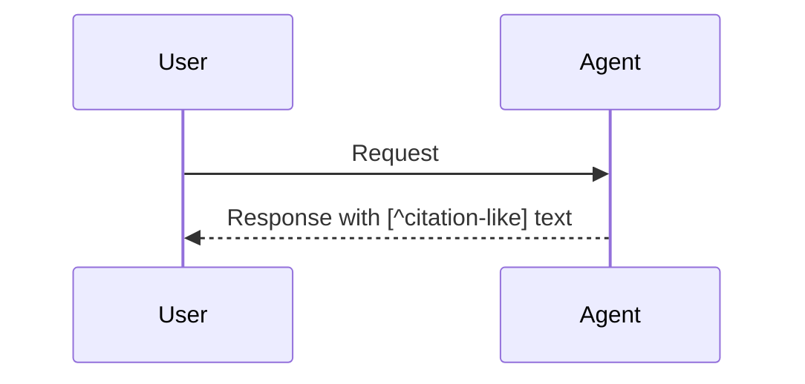
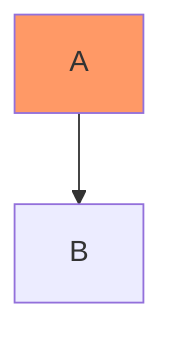

A flowchart:

```mermaid
flowchart LR
  A[Agent] -->|tool call| G{Gateway}
  G -->|allowed| T[Tool]
  G -->|denied| L[(Audit log)]
```

A sequence diagram:

```mermaid
sequenceDiagram
  participant U as User
  participant A as Agent
  U->>A: Request
  A-->>U: Response with [^citation-like] text
```

Mermaid class syntax uses triple colons, which must not be read as a callout:

```mermaid
flowchart TD
  A:::critical --> B
  classDef critical fill:#f96
```
